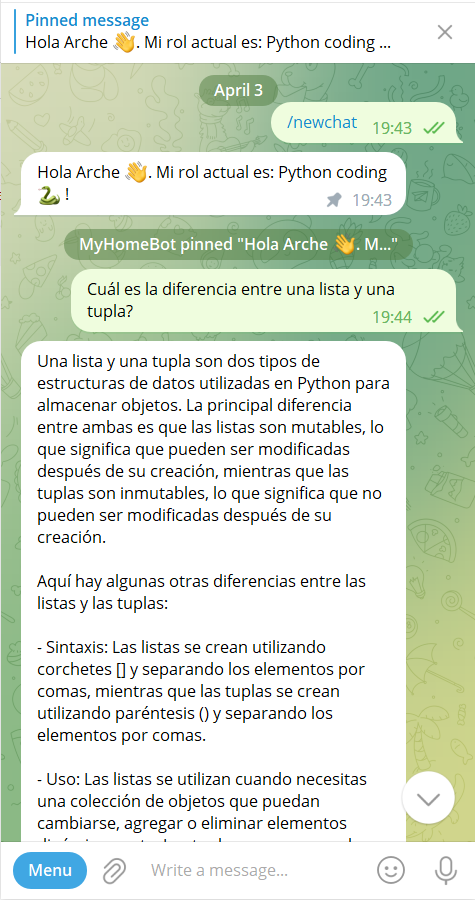
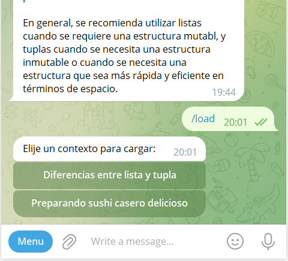
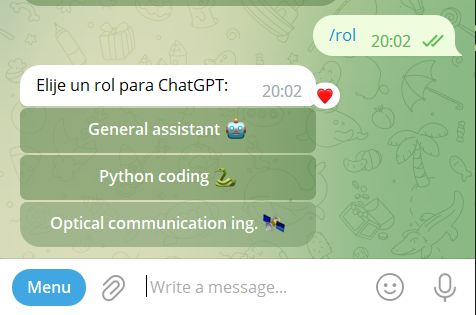

# ChatGPT (gpt-3.5-turbo) sobre un bot de Telegram

Este es un bot de Telegram que utiliza la API de OpenAI para responder cualquier tipo de consulta. Se guarda un registro completo de cada conversación para poder retomar un hilo de conversación en cualquier momento. La conversación puede ser guardada en un archivo para consultas posteriores.

## Tabla de contenido

- [Instalación](#instalación)
- [Uso](#uso)
- [Contribución](#contribución)
- [Autor](#autor)
- [Licencia](#licencia)
- [Contacto](#contacto)
- [Apéndice](#apendice)
  - [Creación del bot de Telegram y obtención del Token:](#creación-del-bot-de-telegram-y-obtención-del-token)
  - [Obtención de la API de OpenAI:](#obtención-de-la-api-de-openai)
  - [Captura de pantalla](#captura-de-pantallas)

## Instalación

### Sigue la secuencia de comandos presentados a continuación:

```bash
git clone https://github.com/armando-palacio/ChatGPT_on_telegram_bot.git
cd ChatGPT_on_telegram_bot
echo -n '{"OPENAI_KEY" : "your_openai_key", "TELEGRAM_TOKEN": "your_telegram_key", "SPEECH_KEY":"your_microsoft_azure_key", "SPEECH_REGION": "your_microsoft_azure_region"}' > keys.json
```

La primera línea de código clona el repositorio en tu computadora. La segunda línea de código te permite acceder a la carpeta del repositorio. La tercera línea de código crea un nuevo archivo llamado `keys.txt` en el que se almacenan las claves de OpenAI, Telegram y Microsoft Azure. En esta línea de código, reemplaza `your_openai_key`, `your_telegram_key`, `your_microsoft_azure_key` y `your_microsoft_azure_region` por tus claves de OpenAI, Telegram y Microsoft Azure.

Luego se necesita fijar las claves a variables de entorno para poder utilizar el código fuente. Sigue los pasos a continuación:

#### En Windows:

```bash
for /f "tokens=1,2 delims== " %G in (keys.json) do setx %G %H
```

#### En linux:

```
echo 'export $(cat variables.json | jq -r "to_entries|map(\"\(.key)=\(.value|tostring)\")|.[]")' >> $HOME/.bashrc
source $HOME/.bashrc
```

Para obtener las claves de OpenAI y Telegram, sigue las instrucciones en la sección [Obtención de la API de OpenAI](#obtención-de-la-api-de-openai) y [Creación del bot de Telegram y obtención del Token](#creación-del-bot-de-telegram-y-obtención-del-token), respectivamente.

### Instalar librerías necesarias:

Para que el programa funcione correctamente es necesario instalar las librerías especificadas en el archivo `requirements.txt`. Para ello se puede ejecutar directamente la línea de comando:

```
pip install -r requirements.txt
```

El programa requiere además `FFmpeg` en el sistema para el correcto funcionamiento del reconocimiento de voz a texto y la sintetización de texto a voz, por lo que es necesario instalarlo en caso de que no lo esté

##### En Windos:

Descargar el [comprimido](https://www.gyan.dev/ffmpeg/builds/ffmpeg-git-full.7z). Descomprimir el archivo y copiar al disco `C:`. Renombrar la carpeta con el nombre 'ffmpeg'. Por último, agrega la ruta de la carpeta `bin` a la variable de entorno `PATH`. Se puede hacer mediante línea de comandos ejecutando `setx PATH "%PATH%;C:/ffmpeg/bin"`. Cierra la consola y listo!

##### En linux:

Simplemente abre una terminal y ejecuta el comando `sudo apt install ffmpeg`, listo!

### Ejecuta el script con:

```bash
python main.py
```

## Uso

Para utilizar el bot, simplemente abre una conversación con él en Telegram y escribe cualquier consulta. El bot responderá con una respuesta generada por la inteligencia artificial de OpenAI.

El bot cuenta con varios comandos adicionales:

- `/newchat`: inicia una nueva conversación y borra todo el histórico de conversaciones anteriores.
- `/log`: muestra el historial completo de la conversación actual.
- `/load`: carga una conversación guardada en un archivo anteriormente.
- `/rol`: cambia el rol de la conversación a una de las opciones predefinidas (General Assistant, Python Coding, Optical Communication Ing.). Estos roles se pueden cambiar en el archivo `main.py` y fijar tantos como se quieran.

## Contribución

Si deseas contribuir al proyecto, puedes hacerlo de varias maneras:

- Corrigiendo errores y optimizando el código.
- Agregando nuevas funcionalidades.
- Mejorando la experiencia de usuario en la interfaz de Telegram.

Cualquier contribución es bienvenida y agradecida.

## Autor

Este proyecto fue creado por el Armando Palacio Romeu.

## Licencia

Este proyecto está bajo la Licencia [MIT](https://choosealicense.com/licenses/mit/). Para más información, consulte el archivo LICENSE.md en la raíz del proyecto.

## Contacto

Si tienes alguna pregunta o sugerencia, puedes contactarme a través de mi correo electrónico:

- armandopr3009@gmail.com

## Apéndice

### Creación del bot de Telegram y obtención del Token:

1. BotFather es el bot oficial de Telegram que te ayuda a crear y administrar bots. Para acceder a BotFather, busca "@BotFather" en Telegram y abre el chat.
2. Crea un nuevo bot: Para crear un nuevo bot, escribe el comando `/newbot` en el chat de BotFather. BotFather te pedirá un nombre para tu bot y un nombre de usuario. Proporciónale un nombre y un nombre de usuario únicos para tu bot.
3. Obtén el token de acceso: BotFather te proporcionará un token de acceso único para tu bot. Este token es una serie de letras y números que actúa como una contraseña para acceder al bot. Escribe el comando `/token` en el chat para obtener el token. Guardalo en un lugar seguro, ya que lo necesitarás para programar tu bot.

### Obtención de la API de OpenAI:

1. Crear una cuenta en la página oficial de OpenAI, si es que aún no tiene una. Dirigirse a [Sign Up](https://auth0.openai.com/u/signup/identifier?state=hKFo2SA1X2txWlpXTS1TQTJWX0F1MjFvNDh3WUFGLXpSNWgzMaFur3VuaXZlcnNhbC1sb2dpbqN0aWTZIFM1MlZnRDdneVZ5RDFQbXBZcC1VV0V3UVllWmtzSnNZo2NpZNkgRFJpdnNubTJNdTQyVDNLT3BxZHR3QjNOWXZpSFl6d0Q).
2. Iniciar sesión y dirigirse a la pestaña de usuario en la parte derecha superior de la página y se seleccionar `View API Key`:
   
3. Crear una nueva API presionando el botón `Create new secret keys`. Copiala y guardala en un lugar seguro, ya que se necesitará para acceder al modelo de generación `gpt-3.5-turbo`.

### Captura de pantalla




